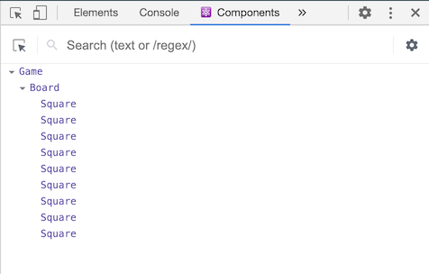

Bu dərslik heç bir mövcud React biliyini təxmin etmir.

## Dərsliyi Başlamazdan Əvvəl {#before-we-start-the-tutorial}

Bu dərslikdə biz kiçik bir oyun yazacağıq. **Siz oyun yazmadığınızdan bunu ötürmək istəyə bilərsiniz -- amma buna bir şans verin.** Bu dərslikdə öyrənəcəyiniz metodlar React applikasiyaları yazmaq üçün əsasdır və bu metodları mənimsəmək sizə React-i dərindən başa düşməyə kömək edəcək.

>Məsləhət
>
>Bu dərslik **praktika ilə öyrənməyə** üstünlük verənlər üçün nəzərdə tutulmuşdur. Əgər siz konsepsiyaları sıfırdan öyrənməyə üstünlük verirsinizsə, bizim [pillə-pillə təlimatımızı](/docs/hello-world.html) nəzərdən keçirin. Bu dərslik və göstərilən təlimat bir-birini tamamlaya bilər.

Bu dərslik bir neçə bölməyə bölünmüşdür:

* [Dərslik üçün Qurulma](#setup-for-the-tutorial) bu dərsliyi izləmək üçün **başlanğıc nöqtəsidir.**
* [İcmal](#overview) React-in **əsaslarını** öyrədəcək: komponentlər, proplar, və state.
* [Oyunu Tamamlamaq](#completing-the-game) React-in təkmilləşdirilməsi üçün **ən çox işlənən metodları** öyrədəcək.
* [Zaman Səyahətinin Əlavəsi](#adding-time-travel) React-in unikal gücləri haqqında **dərin məlumatlar** verəcək.

Bu dərslikdən dəyər almaq üçün bütün bölmələri bir dəfəyə tamamlamaq vacib deyil. Çalışın mümkün qədər çox bölmədən keçəsiniz -- hətta bir və ya iki bölmə olsa belə.

### Biz nə düzəldirik? {#what-are-we-building}

Bu dərslikdə biz React ilə interaktiv "X O oyununu" düzəltməyi göstərəcəyik.

Bizim düzəltdiyimizə buradan baxa bilərsiniz: **[Son Nəticə](https://codepen.io/gaearon/pen/gWWZgR?editors=0010)**. Əgər kod sizə aydın deyilsə və ya sintaksis sizə tanış deyilsə, narahat olmayın! Bu dərsliyin məqsədi sizə React və onun sintaksisini anlamağa kömək etməkdir.

Dərsliyə başlamamışdan qabaq oyuna baxmağınızı tövsiyyə edirik. Bu oyunun diqqət edəcəyiniz xüsusiyyətlərindən biri oyun taxtasının sağında çıxan nömrələnmiş siyahıdır. Bu siyahı oyunda baş vermiş bütün hərəkətlərin tarixçəsidir və bu siyahı oyun davam etdikcə yenilənir.

Oyun ilə tanış olduqdan sonra oyun səhifəsini bağlaya bilərsiniz. Biz bu dərslikdə sadə bir şablon ilə başlayacağıq. Sonraki addım sizi oyunu yazmağa hazır etməkdir.

### Ön şərtlər {#prerequisites}

Biz sizin HTML və Javascript ilə tanışlığınızı təxmin edirik amma siz başqa proqramlaşdırma dilindən gəlsəniz belə davam etməyi bacarmalısınız. Biz sizin proqramlaşdırma konsepsiyaları ilə (funksiyalar, obyektlər, massivlər, və daha az dərəcədə, klaslar) tanışlığınızı təxmin edirik.

Əgər sizə Javascriptə baxmaq lazımdırsa, biz [bu təlimatı](https://developer.mozilla.org/en-US/docs/Web/JavaScript/A_re-introduction_to_JavaScript) oxumağınızı tövsiyyə edirik. Qeyd edirikki, biz həmçinin bəzi ES6 (Javascriptin yeni versiyası) xüsusiyyətlərindən istifadə edirik. Bu dərslikdə, biz [arrow funskiyaları](https://developer.mozilla.org/en-US/docs/Web/JavaScript/Reference/Functions/Arrow_functions), [klaslar](https://developer.mozilla.org/en-US/docs/Web/JavaScript/Reference/Classes), [`let`](https://developer.mozilla.org/en-US/docs/Web/JavaScript/Reference/Statements/let), and [`const`](https://developer.mozilla.org/en-US/docs/Web/JavaScript/Reference/Statements/const) operatorlarından istifadə edirik. Siz [Babel REPL](babel://es5-syntax-example) istifadə edərək ES6 kodunun nəyə kompilyasiya olunduğunu görə bilərsiniz.

## Dərslik üçün Qurulma {#setup-for-the-tutorial}

Bu dərsliyi iki yol ilə tamamlamaq olar: siz kodu brauzerdə yaza və ya kompyuterinizdə lokal təkminləşmə mühiti yarada bilərsiniz.

### Seçim 1: Brauzerdə Kodu Yaz {#setup-option-1-write-code-in-the-browser}

Bu başlamaq üçün ən tez yoldur!

İlk olaraq, bu **[Başlama Kodunu](https://codepen.io/gaearon/pen/oWWQNa?editors=0010)** yeni təbdə açın. Yeni təb sizə boş "X O oyun" taxtası və React kodu göstərəcək. Biz bu dərslikdə React kodu üstündə işləyəcəyik.

Siz indi ikinci seçimi ötüb, [İcmal](#overview) bölməsinə keçə bilərsiniz.

### Seçim 2: Lokal Təkminləşmə Mühiti {#setup-option-2-local-development-environment}

Bu tam istəyə bağlıdır və bu dərslik üçün məcburi deyil!

<br>

<details>

<summary><b>Məcburi Deyil: Üstünlük verdiyiniz kod redaktoru ilə lokal qurulmasının təlimatları</b></summary>

Bu qurulma daha çox vaxt tələb edir amma sizə bu dərsliyi seçdiyiniz redaktor ilə tamamlamağa icazə verir. İzləmək üçün addımlar:

1. Əmin olunki [Node.js](https://nodejs.org/en/) son versiyası qurulub.
2. Yeni layihə yaratmaq üçün [Create React App qurulma təlimatlarını](/docs/create-a-new-react-app.html#create-react-app) izləyin.

```bash
npx create-react-app my-app
```

3. Yeni layihənin `src/` direktoriyasından bütün faylları silin.

> Qeyd:
>
> **Bütün `src` direktoriyasını yox, yalnız daxilindəki faylları silin.**. Biz standart faylları bu layihədəki nümunələr ilə əvəz edəcəyik.

```bash
cd my-app
cd src

# Əgər Mac və ya Linux işlədirsinizsə:
rm -f *

# Əgər Windows işlədirsinizsə:
del *

# Layihə direktoriyasına geri qayıdın:
cd ..
```

4. `index.css` adlı faylı `src/` direktoriyasına [bu CSS kodu](https://codepen.io/gaearon/pen/oWWQNa?editors=0100) ilə əlavə edin.

5. `index.js` adlı faylı `src/` directoriyasına [bu JS kodu](https://codepen.io/gaearon/pen/oWWQNa?editors=0010) ilə əlavə edin.

6. `src/` directoriyasında olan `index.js` faylının ən yuxarısınz aşağıdalı üç sətri əlavə edin:

```js
import React from 'react';
import ReactDOM from 'react-dom';
import './index.css';
```

İndi, əgər siz layihə direktoriyasından `npm start` icra etsəniz və brauzerdə `http://localhost:3000` səhifəni açsanız, boş "X O oyunu" taxtası.

Editorunuz üçün sintaks seçilməsini konfiqurasiya etmək üçün [bu təlimatları](https://babeljs.io/docs/editors/) izləməniz tövsiyyə olunur.

</details>

### Kömək, Mən İlişmişəm!

Əgər ilişmisinizsə, [cəmiyyətimizin dəstək resurslarını](/community/support.html) nəzərdən keçirin. Xüsusilə, [Reactiflux Chat](https://discord.gg/0ZcbPKXt5bZjGY5n) kömək almaq üçün ən tez yoldur. Əgər siz cavab almırsınızsa və ya siz yenədə ilişmisinizsə, xahiş olunur bizə İssue göndərin və biz sizə kömək etməyə cəhd edəcəyik.

## İcmal {#overview}

İndi sizdə hər şey qurulub deyə gəlin of React haqqında məlumat alaq!

### React Nədir? {#what-is-react}

React UI yaratmaq üçen deklarativ, səmərəli, və elastik Javascript kitabxanasıdır. Bu kitabxana sizə "komponent" adlanan balaca və sərbəst kod hissələrinin birləşməsi ilə kompleks UI yaratmağa icazə verir.

React-də bir neçə növ komponent var amma gəlin `React.Component` subklassından yaranan komponentlər ilə başlayaq:

```javascript
class ShoppingList extends React.Component {
  render() {
    return (
      <div className="shopping-list">
        <h1>{this.props.name} üçün alış-veriş siyahısı</h1>
        <ul>
          <li>Instagram</li>
          <li>WhatsApp</li>
          <li>Oculus</li>
        </ul>
      </div>
    );
  }
}

// İşlətmə nümunəsi: <ShoppingList name="Rufat" />
```

Biz bu maraqlı XML-a oxşar təqlərdən sonra danışacağıq. Biz komponentlərdən istifadə edərək React-ə ekranda nə görmək istədiyimizi deyirik. Məlumat dəyişəndə React səmərəli şəkildə komponentləri yeniləyir və yenidən render edir.

Yuxarıdakı nümunədə, ShoppingList bir **React komponent klassı** və ya **React komponent növüdür**. Komponent `props` ("properties" sözünün qısa yazılışı) adında parametrlər qəbul edir və görünüş üçün iyerarxiyalı formada `render` funskiyasından qaytarır.

`render` funskiyası görmək istədiyiniz *məzmunu* qaytarır. React bu məzmun əsasında nəticəni göstərir. Xüsusi ilə, `render` **React elementi** (nə render edildiyinin yüngül məzmununu) qaytarır. Əksər React proqramçıları "JSX" adında xüsusi sintaksis işlədir. Bu sintaksik belə iyerarxiyalı strukturların yazılışını asanlaşdırır. `<div />` sintaksisi qurulma zamanı `React.createElement('div')`-ə çevrilir. Yuxarıdakı nümunənin JSX-siz forması aşağıdakı kimi yazılır:

```javascript
return React.createElement('div', {className: 'shopping-list'},
  React.createElement('h1', /* ... h1 children ... */),
  React.createElement('ul', /* ... ul children ... */)
);
```

[Genişləndirilmiş versiyanı izləyin.](babel://tutorial-expanded-version)

Əgər sizə maraqlıdırsa, `createElement()` [API arayışında](/docs/react-api.html#createelement) daha detallı izah edilir. Biz bu dərslikdə `createElement()` əvəzinə JSX-dən istifadə etməyə davam edəcəyik.

JSX, Javascriptin bütün gücü ilə gəlir. Siz *hər hansı* Javascript ifadəsini JSX-də fiqurlu mötərizənin içərisindən çağıra bilərsiniz. Hər React elementi bir sadə Javascript obyekti obyektidir. Siz bu obyekti dəyişənə təyin edə bilər və ya applikasiyanızda funskiyalara və s. göndərə bilərsiniz.

Yuxarıdakı nümunədə, `ShoppingList` komponenti yalnız hazır qurulmuş DOM komponentlərini (`<div />` və `<li />`) render edir. Amma siz başqa xüsusi komponentləri belə biləşdirə bilərsiniz. Məsələn, siz yuxarıdakı alqı satqı siyahısını `<ShoppingList />` kimi işlədə bilərsiniz. Hər React komponenti inkapsulasiya olunub deyə siz bu komponentləri bir-birindən asılı olmayacaq şəkildə istifadə edə bilərsiniz. Bu xüsusiyyət sadə komponentlərdən kompleks UI-lar yaratmağa icazə verir.

## Başlanğıc Kodunu Yoxlamaq {#inspecting-the-starter-code}

Əgər siz bu dərsliyi **brauzerdə** edəcəksinizsə bu kodu yeni təbdə açın: **[Başlanğıc Kodu](https://codepen.io/gaearon/pen/oWWQNa?editors=0010)**. Əgər siz bu dərsliyi **lokalda** edəcəksinizsə, layihə direktoriyasında olan `src/index.js` faylını açın (siz bu fayla [qurulma](#setup-option-2-local-development-environment) bölməsində əl gəzdirmisiniz).

Başlağıc Kodu sizin yazacağınız üçün baza kodudur. Biz CSS stilləri təmin etmişik ki, siz diqqətinizi yalnız React-i öyrənməyə və "X O oyunu" yazmağa yönləndirəsiniz.

Koda yaxından baxdığınızda, üç React komponentin olacağını görəcəksiniz:

* Square
* Board
* Game

 Square komponent tək bir `<button>`-u və Board komponenti 9 ədəd kvadrat render edir. Game komponenti Board-u elə-belə dəyərlər ilə render edir. Biz bu dəyərləri gələcək bölmələrdə dəyişəcəyik. İndiki zamanda bu kodda interaktiv komponent yoxdur.

### Məlumatı Proplar ilə Göndərmək {#passing-data-through-props}

Gəlin Board komponentindən Square komponentinə məlumat göndərək.

Dərslikdə irəliləyərkən kodları copy-paste etmək normaldır amma biz kodları əl ilə yazmağınızı tövsiyyə edirik. Bu sizə əzələ yaddaşı yaratmağa və daha güclü anlamağa kömək edəcək.

Board-un `renderSquare` funskiyasında, Square-ə `value` propu əlavə edin:

```js{3}
class Board extends React.Component {
  renderSquare(i) {
    return <Square value={i} />;
  }
```

Square-in `render` funskiyasında məlumatı göstərmək üçün `{/* TODO */}` kodunu `{this.props.value}` ilə əvəz edin:

```js{5}
class Square extends React.Component {
  render() {
    return (
      <button className="square">
        {this.props.value}
      </button>
    );
  }
}
```

Öncə:


Sonra: Siz kvadratlarda rəqəmləri görməlisiniz.


**[Bu nöqtəyə kimi olan bütün kod](https://codepen.io/gaearon/pen/aWWQOG?editors=0010)**

Təbriklər! Siz valideyn olan Board komponentindən "propu" uşaq olan Square komponentinə göndərdiniz. React-də məlumat axınını propların göndərilməsi ilə baş verir -- valideyndən uşağa doğru.

### İnteraktiv Komponent Yaratmaq {#making-an-interactive-component}

Gəlin, Square komponentinə tıklandığı zaman kvadratı "X" ilə dolduraq.

İlk öncə Square komponentindəki `render()` funskiyasında olan "button" təqini aşağıdakı koda çevirin:

```javascript{4}
class Square extends React.Component {
  render() {
    return (
      <button className="square" onClick={function() { alert('click'); }}>
        {this.props.value}
      </button>
    );
  }
}
```

Əgər indi siz Square-ə tıklasanız, brauzerdə "click" yazısı ilə xəbərdarlıq alacaqsınız.

>Qeyd
>
>Yazını qısaltmaq və [`this`-in baş qarışdırıcı işləmə prinsipinindən](https://yehudakatz.com/2011/08/11/understanding-javascript-function-invocation-and-this/) kənar olmaq üçün, biz buradakı və sonrakı hadisə işləyicilərində [arrow funskiyaları sintaksisindən istifadə edəcəyik](https://developer.mozilla.org/en-US/docs/Web/JavaScript/Reference/Functions/Arrow_functions):
>
>```javascript{4}
>class Square extends React.Component {
>  render() {
>    return (
>      <button className="square" onClick={() => alert('click')}>
>        {this.props.value}
>      </button>
>    );
>  }
>}
>```
>
>Diqqət edin ki, biz `onClick` propuna *funskiya* göndəririk: `onClick={() => alert('click')}`. React, bu xəbərdarlığın yalnız düymənin klikləndiyi vaxt çıxmasını təmin edir. `() =>`-nu yaddan çıxarıb birbaşa `onClick={alert('click')}` yazmaq tez-tez edilən bir səhvlərdən biridir. Səhv formada yazdıqda, komponentin hər renderindən sonra (məsələn, dəyişiklikdən sonra baş verən yenidən render) xəbərdarlıq göstəriləcək (tıklamaqdan asılı olmayaraq).

Sıradakı addımda, biz Square komponentinin tıklandığını yadda saxlamaq və "X" işarəsi ilə doldurmaq istəyirik. Komponentlər "yadda saxlamaq" üçün **state-dən** istifadə edirlər.

React komponentlərinin state-ləri olması üçün klas konstrukturunda `this.state`-dən istifadə edilir. `this.state` yalnız onu müəyyənləşdirən React komponentinə privat olmalıdır. Gəlin Square-in cari dəyərini `this.state`-də saxlayaq və Square tıklanarkən bu dəyəri dəyişək.

İlk olaraq state-i inisializasiya etmək üçün klasa konstruktor əlavə edək:

```javascript{2-7}
class Square extends React.Component {
  constructor(props) {
    super(props);
    this.state = {
      value: null,
    };
  }

  render() {
    return (
      <button className="square" onClick={() => alert('click')}>
        {this.props.value}
      </button>
    );
  }
}
```

>Qeyd
>
>[JavaScript klaslarında](https://developer.mozilla.org/en-US/docs/Web/JavaScript/Reference/Classes), subklasın konstrukturunu tətbiq etdikdə mütləq `super`-dən istifadə etmək lazımdır. Konstrukturu olan bütün React komponentləri `super(props)` funskiya çağırışı ilə başlamalıdır.

Biz Square komponentinin cari state-inin dəyərini tıklamadan sonra göstərmək üçün, Square-in `render` funskiyasından istifadə edəcəyik:

* `<button>` təqində `this.props.value`-nu `this.state.value` ilə əvəz et.
* `onClick={...}` hadisə işləyicisini `onClick={() => this.setState({value: 'X'})}` ilə əvəz et.
* Oxunaqlığı artırmaq üçün `className` və `onClick` proplarını ayrı sətrlərdə yazın.

Bu dəyişikliklərdən sonra Square-in `render` funskiyasından qaytarılan `<button>` təqi aşağıdakı koda oxşamalıdır:

```javascript{12-13,15}
class Square extends React.Component {
  constructor(props) {
    super(props);
    this.state = {
      value: null,
    };
  }

  render() {
    return (
      <button
        className="square"
        onClick={() => this.setState({value: 'X'})}
      >
        {this.state.value}
      </button>
    );
  }
}
```

Square komponentinin `render` funskiyasında olan `onClick` işləyicisində `this.setState` çağırmaq ilə biz React-ə `<button>` tıklananda komponenti yenidən render etməyi deyirik. Yeniləmədən sonra, Square-in `this.state.value` dəyəri `'X'` olacaq və bu səbəbdən biz oyun taxtasında `X` görəcəyik. Hər hansı bir Square-i tıklayanda, `X` görünəcək.

Komponentdən `setState` çağırdıqda, React avtomatik olaraq komponentin içinsəki uşaq komponentləridə  yeniləyir.

**[Bu nöqtəyə kimi olan bütün kod](https://codepen.io/gaearon/pen/VbbVLg?editors=0010)**

### Developer Alətləri {#developer-tools}

[Chrome](https://chrome.google.com/webstore/detail/react-developer-tools/fmkadmapgofadopljbjfkapdkoienihi?hl=en) və [Firefox](https://addons.mozilla.org/en-US/firefox/addon/react-devtools/) üçün olan React DevTools Genişlənməsi, React komponent iyerarxiyasını brauzerin developer alətlərindən gözdən keçirməyə imkan yaradır.



React DevTools sizə React komponentlərinin state və proplarına baxmağa icazə verir.

React DevTools-u qurduqdan sonra, siz səhifədə hər hansi bir elementə sağ düymə ilə tıklayıb, "Inspect"-ə tıklayıb developer alətlərini açın. React DevTools developer alətlərinin ən son təbində "React" adı ilə görünəcək.

**Nəzərə alın ki, CodePen-də işləməsi üçün əlavə bir neçə addım atmaq lazımdır:**

1. Login edin ve ya qeydiyyatdan keçib emailınızı təsdiq edin (spamın qarşısını almaq üçün lazımdır).
2. "Fork" düyməsini tıklayın.
3. "Change View" düyməsini tıklayıb "Debug mode" seçin.
4. Yeni açılan təbdə brauzerin developer alətlərində React təbi olacaq.

## Oyunu Tamamlamaq {#completing-the-game}

Indi bizdə "X O oyununun" əsas blokları hazırdı. Oyunu tamamlamaq üçün biz "X" və "O"nun sıra ilə yerləşdirilməsini düzəltməli və oyunun sonunda qalibi müəyyənləşdirməliyik.

### State-i Qaldırmaq {#lifting-state-up}

İndi, hər Square komponenti oyunun vəziyyətini saxlayır. Qalibi təyin etmək üçün biz bu 9 kvadratın dəyərini bir yerdə saxlamalıyıq.

Biz Board komponentinin hər Square komponentdən Square-in state-ini istəməsini fikirləşə bilərik. Bunun React-da mümkün olmasına baxmayaraq, biz bu yol ilə getməyi tövsiyyə etmirik. Çünki belə üsulla yazılan kodu başa düşmək və refaktor etmək çətinləşir və baqların şansı artır. Bunu duzəltməyin ən yaxşı yolu oyunun state-ini hissə-hissə hər Square komponentdə saxlamaq əvəzinə bütünlüklə Board komponentində saxlamaqdır. Board komponenti hər Square-ə nə göstərəcəyini, [Square-ə rəqəm göndərdiyimiz kimi](#passing-data-through-props), prop ilə göndərə bilər.

**Çoxlu uşaqdan məlumat yığması və ya iki uşaq komponentin bir-biri ilə kommunikasiya etməsi üçün paylaşılan state-i valideyn komponentində bəyan edin. Valideyn komponent bu state-i  uşaq komponentlərə proplar vasisəti ilə göndərə bilər. Bu metod uşaq komponentlər və valideyn komponentlər arasındakı məlumatları sinxron saxlayır.**

React komponentlərini refaktor etdikdə, state-i valideyn komponentə qaldırmaq çox işlənən praktikadır. Gəlin bu metodu sınayaq.

Board komponentinə konstruktor əlavə edərək Board-un başlanğıc state-inə 9 ədəd `null` olan massiv əlavə edin. Bu 9 ədəd `null` 9 ədəd kvadrat üçündür:

```javascript{2-7}
class Board extends React.Component {
  constructor(props) {
    super(props);
    this.state = {
      squares: Array(9).fill(null),
    };
  }

  renderSquare(i) {
    return <Square value={i} />;
  }
```

Kvadratları doldurduqda, oyun taxtasının vəziyyəti (`this.state.squares` massivi) belə formada olacaq:

```javascript
[
  'O', null, 'X',
  'X', 'X', 'O',
  'O', null, null,
]
```

Board-un `renderSquare` funskiyası indi belə görsənir:

```javascript
  renderSquare(i) {
    return <Square value={i} />;
  }
```

Bu dərsliyi başlayanda biz hər Square-də 0-dan 8-ə kimi rəqəmləri göstərmək üçün Board-dan [`value` propunu göndərdik](#passing-data-through-props). Əvvəlki başqa bir bölmədə isə biz rəqəmləri [Square-in daxili state-indən istifadə edərək](#making-an-interactive-component) "X" ilə əvəz etdik. Bu səbəbdən Square komponenti Board-dan göndərilən `value` propunu saymır.

Biz yenidən propu göndərmək mexanizmindən istifadə edəcəyik. Board komponentindən hər Square-ə kvadratın dəyərini göndərəcəyik (`'X'`, `'O'`, və ya `null`). Biz artıq `squares` massivini Board-un konstrukturunda yaratmışıq və indi biz `renderSquare` funskiyasından bu massivi oxuyacağıq:

```javascript{2}
  renderSquare(i) {
    return <Square value={this.state.squares[i]} />;
  }
```

**[Bu nöqtəyə kimi olan bütün kod](https://codepen.io/gaearon/pen/gWWQPY?editors=0010)**

İndi hər Square `value` propundan bu dəyərlərdən birini alacaq: `'X'`, `'O'`, və ya `null` (boş kvadrat).

İndi biz Square tıklananda nə olacağını dəyişməliyik. Board komponenti kvadratların dəyərlərini özündə saxlayır. Bu səbəbdən biz Square komponentinə Board-un state-ini dəyişməsini bildirməliyik. State, yarandığı komponentə (bu misalda Board komponentinə) privat olduğundan, biz Square komponentindən Board-un state-ini dəyişə bilmirik.

Bunun əvəzinə, biz Board-dan Sqquare-ə funksiya göndərəcəyik. Bu funskiya Square tıklananda çağrılacaq. Board-un `renderSquare` funskiyasını aşağıdakına dəyişəcəyik:

```javascript{5}
  renderSquare(i) {
    return (
      <Square
        value={this.state.squares[i]}
        onClick={() => this.handleClick(i)}
      />
    );
  }
```

>Qeyd
>
>Biz oxumanı artırmaq üçün qaytarılan elementi bir neçə sətrdə yazdıq və Javascriptin `return`-dən sonra nöqtə vergül qoyub kodumuzu sındırmaması üçün qaytarılan komponenti mötərizəyə saldıq.

İndi biz Board-dan Square-ə iki prop göndəririk: `value` və `onClick`. `onClick` propu funksiyadır və Square tıklananda çağrılacaq. Square komponentinə aşağıdakı dəyişiklikləri edəcəyik:

* Square-in `render` funskiyasında `this.state.value`-nu `this.props.value` ilə əvəz edəcəyik
* Square-in `render` funskiyasında `this.setState()`-i `this.props.onClick()` ilə əvəz edəcəyik
* Square state saxlamadığından `constructor`-u Square-dən siləcəyik

Bu dəyişikliklərdən sonra Square komponenti belə olacaq:

```javascript{1,2,6,8}
class Square extends React.Component {
  render() {
    return (
      <button
        className="square"
        onClick={() => this.props.onClick()}
      >
        {this.props.value}
      </button>
    );
  }
}
```

Square tıklandıqda Board-un təmin etdiyi `onClick` funksiyası çağrılır. Bu prosesin icmalı:

1. DOM qurulan `<button>` komponentinin `onClick` propu React-ə tıklama hadisəsi üçün hadisə qəbuledicisi qurmasını deyir.
2. Düymə tıklandığı zaman, React, Square-in `render()` funskiyasında olan `onClick` hadisə işləyicisini çağırır.
3. Bu hadisə işləyicisi `this.props.onClick()` funskiyasını çağırır. Square-in `onClick` propu Board tərəfindən müəyyənləşdirilib.
4. Board-un Square-ə `onClick={() => this.handleClick(i)}` göndərməsindən, Square tıklandığında `this.handleClick(i)` funskiyasını çağırır.
5. Biz `handleClick()` funksiyasını hələ tətbiq etmədiyimizdən bizim kod çökür. Əgər siz indi düyməni tıklasanız, sizdə qırmızı rəngdə xəta səhifəsi "this.handleClick is not a function" formasında çıxacaq.

>Qeyd
>
>DOM `<button>` elementinin qurulmuş komponent olduğundan, bu elementin `onClick` atributunun React-ə xüsusi mənası var. Square kimi xüsusi komponentlər üçün bu atributu adlandırmaq sizdən asılıdır. Biz Square-in `onClick` propunu və ya Board-un `handleClick` funskiyasını başqa cür də adlandıra bilərik və kod eyni formada işləyəcək. React-də hadisələr üçün `on[Event]` və hadisə işləyiciləri üçün `handle[Event]` adları işlətmək adətdir.

Square-i tıkladıqda, `handleClick` funskiyasının olmadığından bizə xəta gələcək. Gəlin indi bu funksiyanı Board klasında tətbiq edək:

```javascript{9-13}
class Board extends React.Component {
  constructor(props) {
    super(props);
    this.state = {
      squares: Array(9).fill(null),
    };
  }

  handleClick(i) {
    const squares = this.state.squares.slice();
    squares[i] = 'X';
    this.setState({squares: squares});
  }

  renderSquare(i) {
    return (
      <Square
        value={this.state.squares[i]}
        onClick={() => this.handleClick(i)}
      />
    );
  }

  render() {
    const status = 'Sonrakı oyunçu: X';

    return (
      <div>
        <div className="status">{status}</div>
        <div className="board-row">
          {this.renderSquare(0)}
          {this.renderSquare(1)}
          {this.renderSquare(2)}
        </div>
        <div className="board-row">
          {this.renderSquare(3)}
          {this.renderSquare(4)}
          {this.renderSquare(5)}
        </div>
        <div className="board-row">
          {this.renderSquare(6)}
          {this.renderSquare(7)}
          {this.renderSquare(8)}
        </div>
      </div>
    );
  }
}
```

**[Bu nöqtəyə kimi olan bütün kod](https://codepen.io/gaearon/pen/ybbQJX?editors=0010)**

Bu dəyişikliklərdən sonra biz Square-ə tıklayaraq oyun taxtasını doldura bilirik. Amma indi oyunun vəziyyəti Square komponentlərdə individual yerləşmək əvəzinə Board komponentində saxlanır. Board-un state-i dəyişdikdə bütün komponentlər avtomatik yenidən render olunurlar. Bütün kvadratların vəziyyətlərini Board komponentində saxlamaq ilə biz gələcəkdə oyunun qalibini də müəyyənləşdirə biləcəyik.

Square komponentində state olmadığından, bütün Square komponentləri Board komponentindən dəyərləri alir və tıklandığı zaman Board komponentinə xəbər verir. React terminalogiyasında, Square komponentləri **kontrol olunan komponentlər** adlanırlar. Board komponentinin bu komponentlər üzərində tam kontrolu var.

Qeydə alin ki, biz `handleClick` funskiyasında mövcud `squares` massivini dəyişmək əvəzinə `.slice()` funskiyasını çağırıb massivin kopiyasını düzəldirik. Gələn bölmədə biz `squares`-in kopiyasını çıxarmağın səbəbini izah edəcəyik.

### Dəyişməzlik Niyə Vacibdir {#why-immutability-is-important}

Əvvəli kod nümunəsində biz mövcud massivi dəyişmək əvəzinə `.slice()` operatoru ilə `squares` massivinin kopiyasını çıxarmağı tövsiyyə etdik. Bu bölmədə biz dəyişməzlik (immutability) və dəyişməzliyi öyrənməyin niyə vacib olduğunu müzakirə edəcəyik.

Normalda məlumatı iki yol ilə dəyişmək olur. Birinci yanaşma məlumatın dəyərlərini birbaşa dəyişməklə məlumatı *mutasiya etməkdir*. İkinci yanaşma isə mövcud məlumatı dəyişikliklər olan kopiyası ilə əvəz etməkdir.

#### Məlumatı Mutasiya ilə Dəyişmək {#data-change-with-mutation}
```javascript
var player = {score: 1, name: 'Orxan'};
player.score = 2;
// player {score: 2, name: 'Orxan'} bərabərdir
```

#### Məlumatı Mutasiyasız Dəyişmək {#data-change-without-mutation}
```javascript
var player = {score: 1, name: 'Orxan'};

var newPlayer = Object.assign({}, player, {score: 2});
// player dəyişməyib, amma newPlayer {score: 2, name: 'Orxan'} bərabərdir

// Əgər siz obyekt yayma sintaksisindən istifadə edirsinizsə, siz belə yaza bilərsiniz:
// var newPlayer = {...player, score: 2};
```

Son nəticənin eyni olmasına baxmayaraq məlumatı mutasiya etmədən dəyişdikdə aşağıdakı faydalardan yararlanırıq.

#### Kompleks Xüsusiyyətlər Sadələşir {#complex-features-become-simple}

Dəyişməzlik kompleks xüsusiyyətlərin tətbiqini çox asanlaşdırır. Bu dərslikdə biz "X O oyununun" tarixçəsinin icmalını və əvvəlki gedişlərə qayıda bilmək üçün "zaman səyahəti" tətbiq edəcəyik. Bu xüsusiyyət yalnız oyunlara xas deyil. Bir çox applikasiyaların tələblərində hərəkətləri geri qaytarmaq və ya qabağa çəkmək olur. Məlumatın birbaşa dəyişməyindən çəkinməklə biz oyunun tarixçəsini saxlaya bilir və saxladığımız tarixçədən istifadə edə bilərik.

#### Dəyişikliklərin Aşkar Edilməsi {#detecting-changes}

Mutasiya olunmuş obyektlərin birbaşa dəyişildiyindən, bu dəyişikliklərin aşkar edilməsi çətindir. Dəyişikliyi tapmaq üçün mutasiya olunmuş obyekt, əvvəlki kopiyaları ilə müqayisə edilməlidir. Bu müqayisə üçün bütün obyekt iyerarxiyası yoxlanmalıdır.

Mutasiya olunmamış obyektlərdə dəyişiklikləri aşkar etmək xeyli dərəcədə asandır. Əgər dəyişməz obyektin referansı əvvəki obyektin referansından fərqlidirsə, bu obyekt dəyişmişdir.

#### React-də Yenidən Render Etməyin Aşkarlanması {#determining-when-to-re-render-in-react}

Dəyişməzliyin əsas faydası React-da bizə _təmiz komponentlərin_ yaranmasına kömək etməsidir. Mutasiya olunmamış məlumatlar ilə biz dəyişikliyin olduğunu asan formada aşkar edə bilərik. Bu tapıntı ilə komponentin yenidən olduğunu müəyyən edə bilərik.

`shouldComponentUpdate()` və *təmiz komponentlər* haqqında öyrənmək üçün [Performansın Optimallaşdırılması](/docs/optimizing-performance.html#examples) səhifəsini oxuya bilərsiniz.

### Funksional Komponentlər {#function-components}

Biz indi Square-i **funskional komponentə** çevirəcəyik.

React-də **funskional komponentlər** komponentlərin sadə formada yazılması üçündür. Bu komponentlərin state-i olmur; yalnız `render` funksiyası olur. `React.Component`-dən törənən klas yazmaq əvəzinə, biz `props` qəbul edən və nəyi render etməyi qaytaran funksiya yaradırıq. Funksional komponentləri yazmaq klas komponentləri yazmaqdan daha az yorucudur. Bir çox komponent belə formada yazıla bilər.

Square klasını aşağıdakı funskiya ilə əvəz edin:

```javascript
function Square(props) {
  return (
    <button className="square" onClick={props.onClick}>
      {props.value}
    </button>
  );
}
```

Biz `this.props`-u işlətdiyimiz hər iki yerdə `props` ilə əvəz etdik.

**[Bu nöqtəyə kimi olan bütün kod](https://codepen.io/gaearon/pen/QvvJOv?editors=0010)**

>Qeyd
>
>Biz Square-i funksional komponentə çevirdikdə, həmçinin `onClick={() => this.props.onClick()}` propunu daha qısa `onClick={props.onClick}`-a (**Hər iki** tərəfdəki mötərizələrin olmamasını qeyd edin) çevirdik.

### Sıranı Gözləmək {#taking-turns}

Biz "X O oyununda" tam aydın olan qüsura düzəltməliyik: "O"-lar oyun taxtasında işarələnə bilmirlər.

Biz ilk gedişi "X" ilə qeyd edək. Bu ilkin dəyər üçün biz Board-un konstruktorunda başlanğıc state-i dəyişməliyik:

```javascript{6}
class Board extends React.Component {
  constructor(props) {
    super(props);
    this.state = {
      squares: Array(9).fill(null),
      xIsNext: true,
    };
  }
```

Hər zaman oyunçu hərəkət etdikdə, `xIsNext` (bulin) kimin sonrakı addımı atdığını müəyyənləşdirmək üçün çevriləcək. `xIsNext`-in dəyərini çevirmək üçün gəlin `handleClick` funskiyasını yeniləyək:

```javascript{3,6}
  handleClick(i) {
    const squares = this.state.squares.slice();
    squares[i] = this.state.xIsNext ? 'X' : 'O';
    this.setState({
      squares: squares,
      xIsNext: !this.state.xIsNext,
    });
  }
```

Bu dəyişiklikdə, "X"-lər və "O"-lar sıralarını gözləyə bilərlər.

Əlavə olaraq Board-un `render` funksiyasındakı "status" mətnində kimin sonrakı addımı atacağını da göstərək:

```javascript{2}
  render() {
    const status = 'Sonrakı oyunçu: ' + (this.state.xIsNext ? 'X' : 'O');

    return (
      // kodun qalanı dəyişməyib
```

Bütün dəyişiklikləri etdikdən sonra Board komponenti belə görünəcək:

```javascript{6,11-16,29}
class Board extends React.Component {
  constructor(props) {
    super(props);
    this.state = {
      squares: Array(9).fill(null),
      xIsNext: true,
    };
  }

  handleClick(i) {
    const squares = this.state.squares.slice();
    squares[i] = this.state.xIsNext ? 'X' : 'O';
    this.setState({
      squares: squares,
      xIsNext: !this.state.xIsNext,
    });
  }

  renderSquare(i) {
    return (
      <Square
        value={this.state.squares[i]}
        onClick={() => this.handleClick(i)}
      />
    );
  }

  render() {
    const status = 'Sonrakı oyunçu: ' + (this.state.xIsNext ? 'X' : 'O');

    return (
      <div>
        <div className="status">{status}</div>
        <div className="board-row">
          {this.renderSquare(0)}
          {this.renderSquare(1)}
          {this.renderSquare(2)}
        </div>
        <div className="board-row">
          {this.renderSquare(3)}
          {this.renderSquare(4)}
          {this.renderSquare(5)}
        </div>
        <div className="board-row">
          {this.renderSquare(6)}
          {this.renderSquare(7)}
          {this.renderSquare(8)}
        </div>
      </div>
    );
  }
}
```

**[Bu nöqtəyə kimi olan bütün kod](https://codepen.io/gaearon/pen/KmmrBy?editors=0010)**

### Qalibi Bəyan Etmək {#declaring-a-winner}

Biz indi kimin sonrakı addımı atacağını bildiyimizdən, gəlin oyunun qalibini və ya oyunda heç bir gedişin qalmadığını göstərək. Qalibi tapmaq üçün aşağıdakı köməkçi funskiyanı faylın sonuna əlavə edin:

```javascript
function calculateWinner(squares) {
  const lines = [
    [0, 1, 2],
    [3, 4, 5],
    [6, 7, 8],
    [0, 3, 6],
    [1, 4, 7],
    [2, 5, 8],
    [0, 4, 8],
    [2, 4, 6],
  ];
  for (let i = 0; i < lines.length; i++) {
    const [a, b, c] = lines[i];
    if (squares[a] && squares[a] === squares[b] && squares[a] === squares[c]) {
      return squares[a];
    }
  }
  return null;
}
```

9 kvadratdan ibarət olan massiv verildikdə, bu funskiya qalibi müəyyənləşdirib, "X", "O" və ya "null" qaytaracaq.

Biz Board-un `render` funskiyasında oyunçunun qazandığını yoxlamaq üçün `calculateWinner(squares)` funskiyasını çağıracağıq. Əgər oyunçu qalib olubsa, biz "Qalib: X" və ya "Qalib: O" formalı mətn göstərəcəyik. Board-un `render` funskiyasındakı `status`-u aşağıdakı formada dəyişəcəyik:

```javascript{2-8}
  render() {
    const winner = calculateWinner(this.state.squares);
    let status;
    if (winner) {
      status = 'Qalib: ' + winner;
    } else {
      status = 'Sonrakı oyunçu: ' + (this.state.xIsNext ? 'X' : 'O');
    }

    return (
      // kodun qalanı dəyişməyib
```

İndi Board-un `handleClick` funksiyasını dəyişərək kvadratın boş olmadığında və ya kiminsə qalib olduğunda funksiyadan tez qaytarıb tıklamanı iqnor edək:

```javascript{3-5}
  handleClick(i) {
    const squares = this.state.squares.slice();
    if (calculateWinner(squares) || squares[i]) {
      return;
    }
    squares[i] = this.state.xIsNext ? 'X' : 'O';
    this.setState({
      squares: squares,
      xIsNext: !this.state.xIsNext,
    });
  }
```

**[Bu nöqtəyə kimi olan bütün kod](https://codepen.io/gaearon/pen/LyyXgK?editors=0010)**

Təbriklər! Sizdə indi işləyən "X O oyunu" var. Həmçinin siz React-in əsaslarını öyrəndiniz. Bu səbəbdən *siz* yəqinki əsl qalibsiniz.

## Zaman Səyahətini Əlavə Etmək {#adding-time-travel}

Son bir tapşırıq kimi, gəlin əvvəlki gedişlərə qayıtmağı tətbiq edək.

### Hərəkətlər Tarixcəsini Yadda Saxlamaq {#storing-a-history-of-moves}

Əgər biz `squares` massivini mutasiya etsə idik, zaman səyahətinin tətbiqi çətin olacaqdı.

Lakin, biz hər gedişdən sonra `slide()` funskiyasından istifadə edərək, `squares` massivinin kopiyasını çıxardıq və bu massivə [mutasiya olunmayan](#why-immutability-is-important) kimi davrandıq. Bu bizə `squares` massivinin bütün köhnə versiyalarını saxlamağa və bu versiyalar arasında naviqasiya etməyə imkan yaradır.

Biz köhnə `squares` massivlərini `history` adında bir massivdə saxlayacağıq. `history` massivi, birinci gedişdən axırıncı gedişə kimi olan oyun taxtasının bütün vəziyyətlərinin təsviridir. Bu massiv aşağıdakı struktura malikdir:

```javascript
history = [
  // Birinci gedişdən əvvəl
  {
    squares: [
      null, null, null,
      null, null, null,
      null, null, null,
    ]
  },
  // Birinci gedişdən sonra
  {
    squares: [
      null, null, null,
      null, 'X', null,
      null, null, null,
    ]
  },
  // İkinci gedişdən sonra
  {
    squares: [
      null, null, null,
      null, 'X', null,
      null, null, 'O',
    ]
  },
  // ...
]
```

İndi biz hansı komponentin bu `history` state-ini saxlayacağına qərar verməliyik.

### State-i Yenidən Qaldırmaq {#lifting-state-up-again}

Biz ən yuxarıda olan Game komponentinin bütün keçmiş hərəkətlərinin siyahısını göstərməsini istəyirik. Bunun üçün bu komponent `history`-ə müraciət edə bilməlidir. Bu səbəbdən biz `history` state-ini Game komponentində saxlayacağıq.

`history` state-inin Game komponentində olması bizə `squares` state-inin bu komponentin uşağı olan Board komponentindən silinməsinə imkan yaradır. Əvvəl Square komponentindən Board komponentinə ["state-i qaldırdığımız"](#lifting-state-up) kimi, biz indi state-i Board komponentindən Game komponentinə qaldırırıq. Bu Game komponentinin Board-un məlumatı üzərində tam kontrolu olmasını bildirir və Board-a `history`-də olan keçmiş gedişləri render etməyə imkan yaradır.

İlk olaraq, biz Game komponentinin konstruktorunda ilkin state-i inisializasiya edəcəyik:

```javascript{2-10}
class Game extends React.Component {
  constructor(props) {
    super(props);
    this.state = {
      history: [{
        squares: Array(9).fill(null),
      }],
      xIsNext: true,
    };
  }

  render() {
    return (
      <div className="game">
        <div className="game-board">
          <Board />
        </div>
        <div className="game-info">
          <div>{/* status */}</div>
          <ol>{/* TODO */}</ol>
        </div>
      </div>
    );
  }
}
```

Sonra biz Board-a `squares` və `onClick` proplarını Game komponentindən almasını təmin edəcəyik. İndi Board-da bütün Square-lər üçün yalnız bir tıklamaq hadisə işləyicisi olduğundan, biz hansı Square-in tıklandığını bilmək üçün, hər Square-in yerini `onClick` işləyicisinə göndərməliyik. Aşağıda Board komponentini yeniləmək üçün olan addımlar göstərilib:

* Board-dan `constructor`-u silin.
* Board-un `renderSquare` funskiyasında, `this.state.squares[i]`-i `this.props.squares[i]` ilə əvəz edin.
* Board-un `renderSquare` funskiyasında, `this.handleClick(i)`-i `this.props.onClick(i)` ilə əvəz edin.

Board komponenti aşağıdakı formada olacaq:

```javascript{17,18}
class Board extends React.Component {
  handleClick(i) {
    const squares = this.state.squares.slice();
    if (calculateWinner(squares) || squares[i]) {
      return;
    }
    squares[i] = this.state.xIsNext ? 'X' : 'O';
    this.setState({
      squares: squares,
      xIsNext: !this.state.xIsNext,
    });
  }

  renderSquare(i) {
    return (
      <Square
        value={this.props.squares[i]}
        onClick={() => this.props.onClick(i)}
      />
    );
  }

  render() {
    const winner = calculateWinner(this.state.squares);
    let status;
    if (winner) {
      status = 'Qalib: ' + winner;
    } else {
      status = 'Sonrakı oyunçu: ' + (this.state.xIsNext ? 'X' : 'O');
    }

    return (
      <div>
        <div className="status">{status}</div>
        <div className="board-row">
          {this.renderSquare(0)}
          {this.renderSquare(1)}
          {this.renderSquare(2)}
        </div>
        <div className="board-row">
          {this.renderSquare(3)}
          {this.renderSquare(4)}
          {this.renderSquare(5)}
        </div>
        <div className="board-row">
          {this.renderSquare(6)}
          {this.renderSquare(7)}
          {this.renderSquare(8)}
        </div>
      </div>
    );
  }
}
```

İndi biz Game komponentinin `render` funskiyasında, tarixçənin ən yeni qeydindən istifadə edərək, qalibi müəyyənləşdirib oyunun statusunu göstərəcəyik:

```javascript{2-11,16-19,22}
  render() {
    const history = this.state.history;
    const current = history[history.length - 1];
    const winner = calculateWinner(current.squares);

    let status;
    if (winner) {
      status = 'Qalib: ' + winner;
    } else {
      status = 'Sonrakı oyunçu: ' + (this.state.xIsNext ? 'X' : 'O');
    }

    return (
      <div className="game">
        <div className="game-board">
          <Board
            squares={current.squares}
            onClick={(i) => this.handleClick(i)}
          />
        </div>
        <div className="game-info">
          <div>{status}</div>
          <ol>{/* TODO */}</ol>
        </div>
      </div>
    );
  }
```

Game komponentinin oyun statusunu göstərdiyindən, biz bu eyni kodu Board-un `render` funskiyasından silə bilərik. Refaktor etdikdən sonra, Board-un `render` funskiyası belə görünəcək:

```js{1-4}
  render() {
    return (
      <div>
        <div className="board-row">
          {this.renderSquare(0)}
          {this.renderSquare(1)}
          {this.renderSquare(2)}
        </div>
        <div className="board-row">
          {this.renderSquare(3)}
          {this.renderSquare(4)}
          {this.renderSquare(5)}
        </div>
        <div className="board-row">
          {this.renderSquare(6)}
          {this.renderSquare(7)}
          {this.renderSquare(8)}
        </div>
      </div>
    );
  }
```

Ən sonda, biz `handleClick` funskiyasını Board komponentindən Game komponentinə köçürməliyik. Həmçinin biz oyun komponentində state-in stukturunun fərqli olduğunu nəzərə alaraq `handleClick`-i dəyişməliyik. Game-in `handleClick` funskiyasında, biz yeni tarixçə qeydlərini `history` massivinə birləşdiririk.

```javascript{2-4,10-12}
  handleClick(i) {
    const history = this.state.history;
    const current = history[history.length - 1];
    const squares = current.squares.slice();
    if (calculateWinner(squares) || squares[i]) {
      return;
    }
    squares[i] = this.state.xIsNext ? 'X' : 'O';
    this.setState({
      history: history.concat([{
        squares: squares,
      }]),
      xIsNext: !this.state.xIsNext,
    });
  }
```

>Qeyd
>
>Bizim tanıdığımız massivdə olan `push()` funskiyasından fərqli olaraq, `concat()` funskiyası orijinal massivi mutasiya etmir. Bu səbəbdən biz `concat`-ə üstünlük veririk.

Bu nöqtədə, Board komponentinə yalnız `renderSquare` və `render` funkisyaları lazımdır. Oyunun vəziyyəti və `handleClick` funskiyası Game komponentində olmalıdır.

**[Bu nöqtəyə kimi olan bütün kod](https://codepen.io/gaearon/pen/EmmOqJ?editors=0010)**

### Keçmiş Hərəkətləri Göstərmək {#showing-the-past-moves}

Biz "X O oyununun" tarixçəsini saxladığımızdan, biz indi gedişlərin siyahısını oyunçuya göstərə bilərik.

Biz React elementlərinin 1-ci klas Javascript obyetkləri olduğunu və bu obyektərin applikasiyada fərqli yerlərə göndərilə bildiyini öyrəndik. Bir neçə elementi render etmək üçün, biz React elementlərinin massivindən istifadə edə bilərik.

JavaScriptdə massivlərdə məlumatları başqa məlumatlara uzlaşdırmaq üçün [`map()` funskiyası var](https://developer.mozilla.org/en-US/docs/Web/JavaScript/Reference/Global_Objects/Array/map). Məsələn:

```js
const numbers = [1, 2, 3];
const doubled = numbers.map(x => x * 2); // [2, 4, 6]
``` 

`map` funskiyasından istifadə edərək, biz gedişlərin tarixçəsini ekranda düymələri göstərən React elementlərinə uzlaşdırıb, keçmiş gedişlərə "tullanmaq" üçün düymələr siyahısını göstərə bilərik.

Gəlin Game-in `render funskiyasında `history`-nin üzərindən `map` edək:

```javascript{6-15,34}
  render() {
    const history = this.state.history;
    const current = history[history.length - 1];
    const winner = calculateWinner(current.squares);

    const moves = history.map((step, move) => {
      const desc = move ?
        'Gedişə get: #' + move :
        'Oyunun əvvəlinə qayıt';
      return (
        <li>
          <button onClick={() => this.jumpTo(move)}>{desc}</button>
        </li>
      );
    });

    let status;
    if (winner) {
      status = 'Qalib: ' + winner;
    } else {
      status = 'Sonrakı oyunçu: ' + (this.state.xIsNext ? 'X' : 'O');
    }

    return (
      <div className="game">
        <div className="game-board">
          <Board
            squares={current.squares}
            onClick={(i) => this.handleClick(i)}
          />
        </div>
        <div className="game-info">
          <div>{status}</div>
          <ol>{moves}</ol>
        </div>
      </div>
    );
  }
```

**[Bu nöqtəyə kimi olan bütün kod](https://codepen.io/gaearon/pen/EmmGEa?editors=0010)**

"X O oyununun" tarixində olan bütün gedişlər üçün biz içərisində düymə `<button>` olan siyahı bəndi `<li>` yaradırıq. Düymənin `onClick` işləyicisi `this.jumpTo()` adlanan funskiyanı çağırır. Biz `jumpTo` funskiyasını hələki tətbiq etməmişik. İndi, biz oyunda baş vermiş bütün gedişlərin siyahısını və developer alətləri konsolunda aşağıdakı xəbərdarlığı görməliyik:

>  Xəbərdarlıq:
>  Massiv və ya iteratorda hər bir uşağın unikal "key" propu olmalıdır. "Game" komponentinin render funksiyasına baxın.

Gəlin yuxarıdakı xəbərdarlığın nə olduğunu müzakirə edək.

### Açarın Seçilməsi {#picking-a-key}

Siyahı render etdikdə, React hər render olunmuş siyahı bəndi haqqında məlumat saxlayır. Siyahı yeniləndikdə React nəyin dəyişdiyini müəyyən etməlidir. Biz siyahı bəndlərinə yenisini əlavə edə, bəndi silə, bəndlərinin yerini dəyişə və ya list bəndləri yeniləyə bilərik.

Aşağıdakından

```html
<li>Aydan: 7 tapşırıq qalıb</li>
<li>Elnur: 5 tapşırıq qalıb</li>
```

aşağıdakına

```html
<li>Elnur: 9 tapşırıq qalıb</li>
<li>Aysel: 8 tapşırıq qalıb</li>
<li>Aydan: 5 tapşırıq qalıb</li>
```

keçidi fikirləşin.

Sayın çoxalmağından əlavə, bunu oxuyan insan, bizim Aydan ilə Elnurun sıralamasının dəyişdiyini, və Ayselin Aydan ilə Elnurun arasına əlavə edildiyini deyə bilər. Lakin, React bir kompyuter proqramı olduğundan bizim nə etmək istədiyimizi bilmir. React-in bizim niyyətimizi bilmədiyi üçün, biz hər siyahı bəndinə, qonşularından fərqləndirmək üçün, *açar* parametri ilə təyin etməliyik. Bir seçim `aydan`, `elnur`, və `aysel` sətirlərini açar kimi işlətməkdir. Əgər siz məlumatları kənar bir məlumat bazasından oxuyursunuzsa, Aydan, Elnur, və Ayselin məlumat bazasında olan IDlərini açar kimi işlətmək olar.

```html
<li key={user.id}>{user.name}: {user.taskCount} tapşırıq qalıb</li>
```

Siyahı yenidən render etdikdə, React hər siyahı elementinin açarını götürür və keçmiş siyahıda eyni açarlı elementləri axtarır. Əgər cari siyahıda olan açar əvvəl mövcud deyildisə, React yeni komponent yaradır. Əgər keçmiş siyahıda olan açar cari siyahıda yoxdursa, React əvvəlki komponenti dağıdır. Əgər açarlar eynidirsə, açarı saxlayan element yerini dəyişir. Açarlar React-ə hər komponentin şəxsiyyəti haqqında məlumat verir və React-ə yenidən renderlər arası state-i saxlayır. Əgər komponentin açarı dəyişirsə, komponent dağılıb və yeni state ilə düzəlir.

`key` React-də xüsusi və reservlənmiş parametrdir (daha təkminli xüsusiyyət olan `ref` ilə birlikdə). Element yarandığı zaman React `key` parametrini çıxarır və bu açarı birbaşa qaytarılan elementdə saxlayır. `key`-in `props`-a aid olduğu görünsə belə, `key`, `this.props.key` ilə çağrıla bilməz. React avtomatik olaraq `key`-dən istifadə edərək hansı komponentin yenilənəcəyinə qərar verir. Komponent öz `key`-ini soruşa bilməz.

**Dinamik siyahılar yaratdığınız zaman düzgün açarların təyin edilməsi ciddi şəkildə tövsiyyə olunur.** Əgər sizdə lazımi açar yoxdursa, sizin açar olana kimi məlumatınızın strukturunu dəyişməniz lazım ola bilər.

Əgər açar təyin edilməyibsə, React sizə xəbərdarlıq edib, massivin indeksini açar kimi işlədəcək. Massiv indeksini açar kimi işlətdikdə, siyahıdakı elementlərin yerini dəyişmək və ya elementləri əlavə edib/silmək problemli olur. Açıq-aydın `key={i}` göndərildikdə xəbərdarlıq susdurulur amma massiv indeksini göndərmək ilə olan problemlər yenədə qalır. Bu səbəbdən, bir çox halda belə formada xəbərdarlığı susdurmaq tövsiyyə edilmir.

Açarlar qlobal formada unikal olmamalıdırlar. Yalnız komponentlər və qonşular arası unikal olmalıdırlar.

### Zaman Səyahətini Tətbiq Etmək {#implementing-time-travel}

"X O oyununun" tarixində, hər bir keçmiş gedişin unkial ID-si var: gedişin ardıcıllıq rəqəmi. Bu gedişlərin yeri heç vaxt dəyişmir, silinmir, və ya ortadan gediş əlavə olunmur. Bu səbəbdən, gedişin indeksini açar kimi işlətmək təhlükəsizdir.

Game komponentinin `render` funskiyasında, açarı `<li key={move}>` formada yaza bilərik. React-in açarlar haqqında olan xəbərdarlığı itəcək:

```js{6}
    const moves = history.map((step, move) => {
      const desc = move ?
        'Gedişə get #' + move :
        'Oyunun əvvəlinə qayıt';
      return (
        <li key={move}>
          <button onClick={() => this.jumpTo(move)}>{desc}</button>
        </li>
      );
    });
```

**[Bu nöqtəyə kimi olan bütün kod](https://codepen.io/gaearon/pen/PmmXRE?editors=0010)**

`jumpTo` funskiyasın olmadığından siyahıdakı hər hansı bir düyməni tıkladıqda xəta baş verir. `jumpTo` funskiyasını tətbiq etməmişdən qabaq, biz hansı gedişdə olduğumuzu bilmək üçün `stepNumber` state-ini Game komponentinə əlavə edəcəyik.

İlk olaraq, `stepNumber: 0`-ı Game `constructor`-da başlanğıc state-ə əlavə edin:

```js{8}
class Game extends React.Component {
  constructor(props) {
    super(props);
    this.state = {
      history: [{
        squares: Array(9).fill(null),
      }],
      stepNumber: 0,
      xIsNext: true,
    };
  }
```

Sonra, biz `stepNumber`-i yeniləmək üçün Game komponentində `jumpTo` funskiyasını tətbiq edəcəyik. Əlavə olaraq, biz `stepNumber` cüt rəqəm olduqda `xIsNext` state-ini true edəcəyik:

```javascript{5-10}
  handleClick(i) {
    // Bu funksiya dəyişməyib
  }

  jumpTo(step) {
    this.setState({
      stepNumber: step,
      xIsNext: (step % 2) === 0,
    });
  }

  render() {
    // Bu funksiya dəyişməyib
  }
```

Biz həmçinin Game-in `handleClick` funksiyasında kiçik dəyişikliklər edəcəyik.

Əlavə etdiyimiz `stepNumber` state-i istifadəçiyə gedişi göstərir. Yeni gediş etdikdə isə, biz `stepNumber`-i yeniləmək üçün `stepNumber: history.length`-nu `this.setState` funskiyasının arqumentinin bir hissəsi kimi əlavə etməliyik. Bu biz yeni gediş əlavə etdikdə eyni gedişi göstərməyin qabağını alır.

Biz həmçinin `this.state.history`-ni oxumağı `this.state.history.slice(0, this.state.stepNumber + 1)` ilə əvəz edəcəyik. Bu, biz keçmişdə olduğumuz zaman hərəkət etdikdə, olduğumuz nöqtədən yeni gedişin əlavə edilməsi və qalan "gələcək" gedişləri tarixinin silinməsini təmin edir.

```javascript{2,13}
  handleClick(i) {
    const history = this.state.history.slice(0, this.state.stepNumber + 1);
    const current = history[history.length - 1];
    const squares = current.squares.slice();
    if (calculateWinner(squares) || squares[i]) {
      return;
    }
    squares[i] = this.state.xIsNext ? 'X' : 'O';
    this.setState({
      history: history.concat([{
        squares: squares
      }]),
      stepNumber: history.length,
      xIsNext: !this.state.xIsNext,
    });
  }
```

Son olaraq, biz Game komponentinin `render` funskiyasında ən sonuncu gedişi göstərmək əvəzinə `stepNumber` indeksi ilə olan gedişi göstərməliyik:

```javascript{3}
  render() {
    const history = this.state.history;
    const current = history[this.state.stepNumber];
    const winner = calculateWinner(current.squares);

    // kodun qalanı dəyişməyib
```

Biz oyun tarixində hər hansı bir addıma qayıtsaq, "X O oyununun" taxtası bizə o addımdan sonra oyunun vəziyyətini bizə göstərmək üçün yenilənəcək.

**[Bu nöqtəyə kimi olan bütün kod](https://codepen.io/gaearon/pen/gWWZgR?editors=0010)**

### Yekunlaşdırmaq {#wrapping-up}

Təbriklər! Siz aşağıdakı xüsusiyyətləri olan "X O oyunu" yaratdınız:

* Oyunu oynamağa icazə verir,
* Oyunun qalibini müəyyənləşdirir,
* Oyunu oynadığınız müddətdə bütün tarixini saxlayır,
* Oyunçulara oyunun tarixinin icmalını və keçmiş versiyalarını görməyə imkan verir.

Arzulayırıq ki, siz də React-in işləməyi ilə bağlı fikir yarandı.

Son nəticəni buradan göndərə bilərsiniz: **[Son Nəticə](https://codepen.io/gaearon/pen/gWWZgR?editors=0010)**.

Əgər sizdə əlavə vaxt varsa və ya yeni React bacarıqlarını möhkəmləndirmək istəyirsinizsə, aşağıda bu oyunu təkminləşdirmək üçün bəzi ideayalar var (çətinliyin artırılması sırası ilə):

1. Hər gedişin yerini gediş tarixi siyahısında (sütun, sıra) formatında göstərmək.
2. Seçilmiş gediş siyahısını qalın şrift ilə göstər.
3. Board-dakı kvadratları hardkod etmək əvəzinə iki sikl ilə yaradın.
4. Gedişləri artan və ya azalan sıralama ilə sıralamaq üçün düymə əlavə edin.
5. Əgər kimsə qalib olubsa, oyunu qazanan üç kvadratı vurğulayın.
6. Əgər heç kəs qalib gəlmirsə, heç-heçə olduğunu göstərin.

Bu dərslik zamanı biz React-in konsepsiyalarını (elementlər, proplar, state, və komponentlər) nəzərdək keçirdik. Bu mövzular ilə bağlı daha ətraflı izahat üçün, [qalan sənədləri](/docs/hello-world.html) oxuyun. Komponentlərin müəyyənləşdirilməsi haqqında daha ətraflı məlumat almaq üçün, [`React.Component` API Arayışını](/docs/react-component.html) oxuyun.
